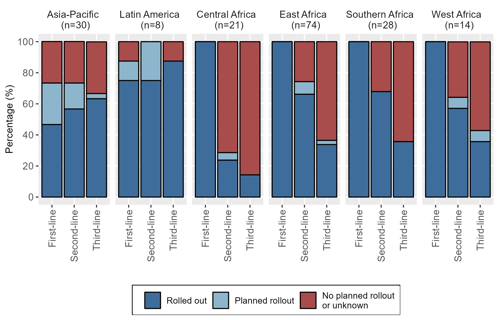
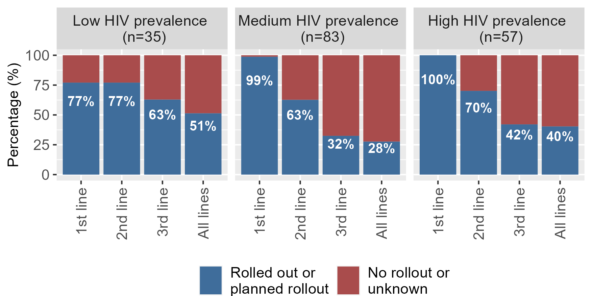
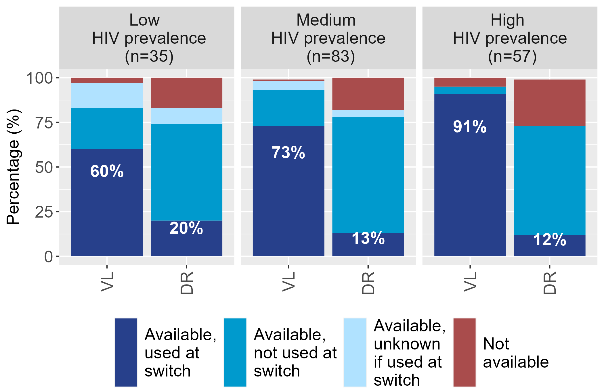
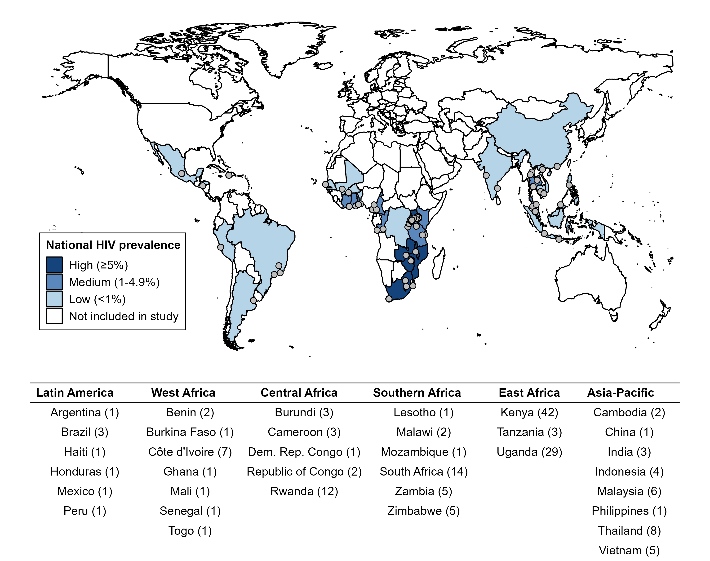
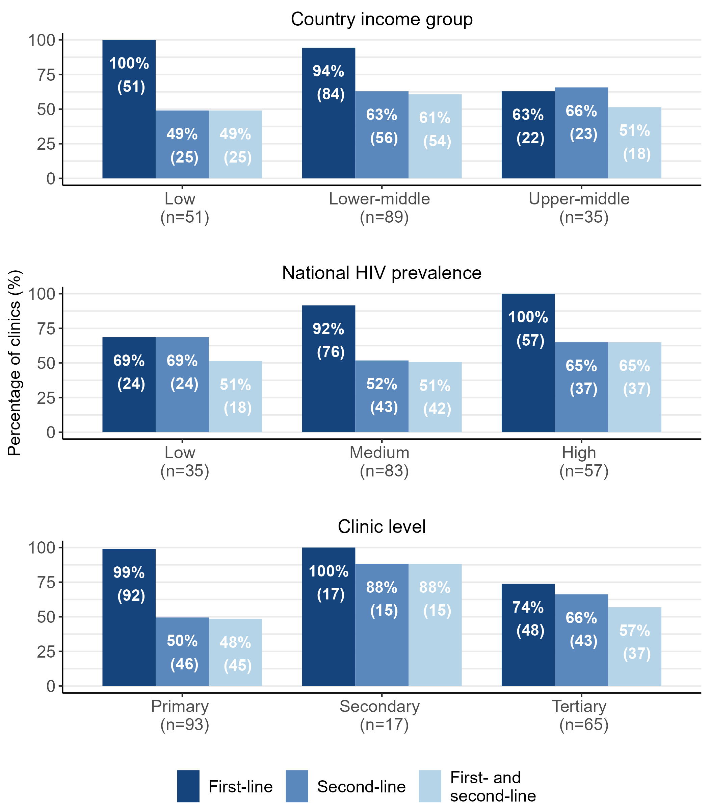

# Assessing transition to DTG-based ART at HIV treatment clinics.

This repository shares the R coding files used to produce analyses and output included in the following:

### CROI 2023 conference abstract

> Zaniewski E, Whitesell V, Egger E, Semeere A, Kunzekwenyika C, Mundhe S, et al. on behalf of the IeDEA consortium. Transition to dolutegravir-based ART in low- and middle-income countries in IeDEA. [CROI abstract](https://www.croiconference.org/abstract/transition-to-dolutegravir-based-art-in-low-and-middle-income-countries-in-iedea/)  and [CROI poster presentation](https://www.croiconference.org/wp-content/uploads/sites/2/posters/2023/MR190_CROI2023_poster_14Feb2023-133208724161778484.pdf)

### *AIDS* 2024 manuscript

> Zaniewski E, Skrivankova VW, Brazier E, Avihingsanon A, Cardoso SW, Cesar C, et al. (2024) Transition to dolutegravir-based ART in 35 low- and middle-income countries: a global survey of HIV care clinics. *AIDS, Dec 2024*. [*AIDS, Dec 2024*. DOI: 10.1097/QAD.0000000000004007](https://journals.lww.com/aidsonline/abstract/9900/transition_to_dolutegravir_based_art_in_35_low_.550.aspx)  

## Data
IeDEA cross-sectional site assessment survey conducted in 2020-2021 has been summarized in the following peer-reviewed manuscript: 

> Brazier E, Maruri F, Wester CW, Musick B, Freeman A, Parcesepe A, et al. (2023) Design and implementation of a global site assessment survey among HIV clinics participating in the International epidemiology Databases to Evaluate AIDS (IeDEA) research consortium. *PLoS One, March 2023* [doi: 10.1371/journal.pone.0268167](https://journals.plos.org/plosone/article?id=10.1371/journal.pone.0268167)

## Methods
Assessed the status of dolutegravir rollout and viral load and drug resistance testing practices for patients on ART switching to dolutegravir-based regimens. We used generalized estimating equations (GEE) to assess associations between clinic rollout of both first- and second-line dolutegravir-based ART regimens (dual rollout) and site-level factors.

Statistical analyses performed using R Statistical Software (v4.3.3; R Core Team 2022) with RStudio (version 2023.12.1).

## Coding files in R

 [Data preparation Rmd file](MR190_R/04_Rmd/01_Data_wrangling.Rmd)   

 [Abstract figures Rmd file](MR190_R/04_Rmd/02_CROI2023_Abstract.Rmd)  

 [Poster presentation figures Rmd file](MR190_R/04_Rmd/03_CROI2023_Poster_Table1_Fig1-3.Rmd)  

 [Manuscript figures Rmd file](MR190_R/04_Rmd/06_Manuscript_Tables_Figures_v3.Rmd)  

## Abstract Figure
 
 
**Figure 1. Transition to DTG regimens by region.**  

## Poster Figures

 
**Figure 1. Transition to DTG regimens by HIV prevalence category and treatment line.**   
___
 
**Figure 2. VL monitoring and DR testing availability and use at switch to DTG regimens by HIV prevalence category**   

## Manuscript Figures

 
**Figure 1. Location of 175 HIV clinics in low- and middle-income countries participating in the survey.**   
___
 
**Figure 2. Reported rollout of dolutegravir-based ART for first-line, second-line and for both first- and second-line regimens among 175 surveyed HIV clinics by country income, HIV prevalence and clinic level.**   
___

**Figure 3. Univariable and multivariable logistic regression of reported rollout of dolutegravirbased ART for both first- and second-line regimens among 175 HIV clinics.**   
*Likelihood ratio test.
Abbreviations: ART; antiretroviral therapy; CI, confidence interval; OR, odds ratio.

## License 

© 2024 The Authors. Published by Wolters Kluwer Health, Inc. This is an open-access article distributed under the terms of the Creative Commons Attribution-Non Commercial-No Derivatives License 4.0 (CC BY-NC-ND), where it is permissible to download and share the work provided it is properly cited. The work cannot be changed in any way or used commercially without permission from the journal.

This is an open access article under the [CC BY-NC-ND 4.0 license.](LICENSE-CC-BY-NC-ND) https://creativecommons.org/licenses/by-nc-nd/4.0/  

___

[![CC BY-NC-ND 4.0][cc-by-nc-nd-image]][cc-by-nc-nd]

[cc-by-nc-nd]: http://creativecommons.org/licenses/by-nc-nd/4.0/
[cc-by-nc-nd-image]: https://licensebuttons.net/l/by-nc-nd/4.0/88x31.png
